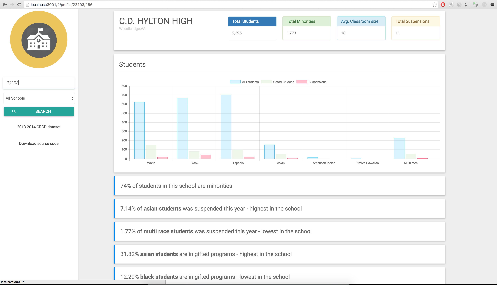

# Civil Rights Data Collection Dataset 


## About 
The civil rights data collectio is something department of Ed does every year where they ask schools across America to fill out a questionnaire about their school   like how many students are enrolled by race. How many of those students are in gifted programs. How many students was suspended by race and a bunch of other useful information. This repo is an interface to see the data.

##Requirments 
Postgres 5.5 

Node 5.8


## Config 
after cloning set up your db creds in configs/config.js 

## Install 
```
git clone 
set up db creds in config/config.js
npm install 
npm run update 
npm run import 
npm start 
```


